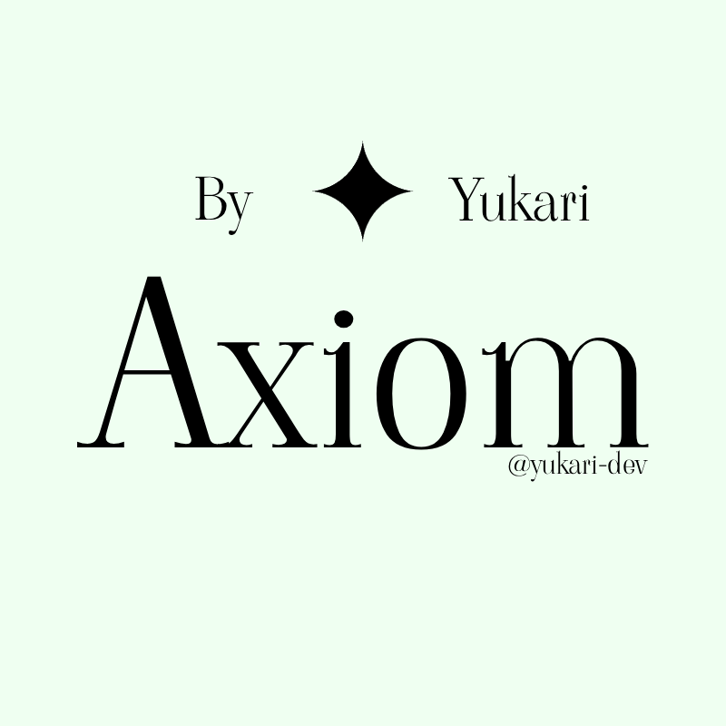

<a id="readme-top"></a>

<br />
<div align="center">
  <a href="https://github.com/Yukari_dev/Axiom">
    
  </a>

<h3 align="center">Axiom</h3>

  <p align="center">
A lightweight, high-performance 2D Graphics Rendering Library built in C++20 using modern Vulkan. 

Axiom encapsulates Vulkan boilerplate into a clean 2D rendering API featuring batching, SDF font rendering, and custom shader pipelines.    <br />
    <a href="https://github.com/Yukari-dev/Axiom"><strong>Explore the docs »</strong></a>
    <br />
    <br />
    &middot;
    <a href="https://github.com/Yukari-dev/Axiom/issues/new?labels=bug&template=bug-report---.md">Report Bug</a>
    &middot;
    <a href="https://github.com/Yukari-dev/Axiom/issues/new?labels=enhancement&template=feature-request---.md">Request Feature</a>
  </p>
</div>

<details>
  <summary>Table of Contents</summary>
  <ol>
    <li>
      <a href="#about-the-project">About The Project</a>
      <ul>
        <li><a href="#built-with">Built With</a></li>
      </ul>
    </li>
    <li>
      <a href="#getting-started">Getting Started</a>
      <ul>
        <li><a href="#prerequisites">Prerequisites</a></li>
        <li><a href="#installation">Installation</a></li>
      </ul>
    </li>
    <li><a href="#usage">Usage</a></li>
    <li><a href="#roadmap">Roadmap</a></li>
    <li><a href="#contributing">Contributing</a></li>
    <li><a href="#license">License</a></li>
    <li><a href="#contact">Contact</a></li>
    <li><a href="#acknowledgments">Acknowledgments</a></li>
  </ol>
</details>

## About The Project

Axiom is a high-performance 2D graphics rendering engine written in C++20 and powered by modern Vulkan. It abstracts away low-level Vulkan verbosity handling device creation, swapchains, command pools, and pipeline state objects under the hood, while exposing a clean, intuitive API for high-level rendering.

Engineered specifically as a lightweight rendering backend for custom UI frameworks, Axiom provides:

* Efficient 2D Batching: High-speed quad, primitive, and textured mesh rendering using single-pass batching.
* SDF Font Rendering: Resolution-independent Signed Distance Field text rendering for crisp UI typography at any zoom level.
* Modular Vulkan RHI: A clean Render Hardware Interface wrapping buffers, textures, framebuffers, and synchronization objects without leaking Vulkan headers into your main project.
* Integrated Shader Compilation: Automatic runtime/build-time GLSL to SPIR-V shader compilation via glslc.
* Standalone Static Library: Packages cleanly into libaxiom.a, allowing downstream projects to link directly against compiled graphics primitives.

### Built With
* [![C++20][Cpp-badge]][Cpp-url]
* [![Vulkan][Vulkan-badge]][Vulkan-url]
* [![CMake][CMake-badge]][CMake-url]
* [![GLFW][GLFW-badge]][GLFW-url]
* [![GLSL][GLSL-badge]][GLSL-url]

<!-- GETTING STARTED -->
## Getting Started

To get a local copy of Axiom up and running on your system, follow these steps to install the necessary dependencies, build the static library, and optionally install it system-wide.
### Prerequisites

Ensure you have a C++20 compliant compiler, CMake, and the Vulkan SDK installed on your system.

* Arch-Based:
  ```sh
  sudo pacman -S base-devel cmake vulkan-devel glfw-x11 glslang
  ```
* Fedora:
  ```sh
  sudo dnf install gcc-c++ cmake vulkan-headers vulkan-loader-devel glfw-devel glslc
  ```
* Debian:
  ```sh
  sudo apt update
  sudo apt install build-essential cmake libvulkan-dev vulkan-tools libglfw3-dev shaderc
  ```

### Installation

1. Clone the repository:
   ```sh
   git clone https://github.com/Yukari-dev/Axiom.git
   cd Axiom
   ```
2. Configure the build directory:
   ```sh
   mkdir build && cd build
   cmake -DCMAKE_BUILD_TYPE=Release ..
   ```
3. Compile libaxiom.a and the sandbox driver:
   ```sh
   make -j$(nproc)
   ```
4. _(Optional)_ Install libaxiom.a and headers system-wide (/usr/local/):
   ```sh
   sudo make install
   ```

## Usage

Axiom can be consumed either by linking to the installed system library (libaxiom.a) or by including it directly in your project tree.
#### Basic C++ Example
Create a folder named `src` and put all your `.cpp` files in it, in this example, the following file is not gonna be placed inside `src/` and named main.cpp
Here is a minimal setup initializing a window, setting up the Vulkan RHI context, and rendering 2D primitives within a render loop:
```cpp
#include <axiom.h>

int main() {
    // 1. Initialize Window & Vulkan RHI Context
    Axiom::Init();
    int width = 800;
    int height = 600;
    Axiom::Window window(width, height, "Axiom Render Loop");
    Axiom::RhiContext rhiContext(window.GetHandler(), width, height);
    Axiom::Renderer2D renderer(rhiContext);

    while (!window.ShouldClose()) {
      window.PollEvents();

      rhiContext.BeginFrame();
      renderer.Begin();

      // Draw colored 2D quad (position, size, color)
      renderer.DrawRect(
        { 100.0f, 100.0f }, // position 
        { 200.0f, 150.0f }, // size
        { 0.2f, 0.8f, 0.4f }// color
      );

      renderer.End();
      rhiContext.EndFrame();
    }

    Axiom::Shutdown();
    return 0;
}

```
### Linking with CMake

Add Axiom to your downstream application's CMakeLists.txt using find_library:
```CMake

# Replace ${PROJECT_NAME} with the actual name (e.g. app_project)
cmake_minimum_required(VERSION 3.20)
project(${PROJECT_NAME} VERSION 0.1.0 LANGUAGES CXX)

set(CMAKE_EXPORT_COMPILE_COMMANDS ON)
set(CMAKE_CXX_STANDARD 20)
set(CMAKE_CXX_STANDARD_REQUIRED ON)

find_package(Vulkan REQUIRED)
find_package(glfw3 REQUIRED)

# 1. Find library strictly in /usr/local/lib
find_library(AXIOM_LIB 
    NAMES axiom
    PATHS /usr/local/lib
    NO_DEFAULT_PATH
)

# 2. Find header path strictly in /usr/local/include
find_path(AXIOM_INCLUDE_DIR 
    NAMES axiom.h
    PATHS /usr/local/include
    NO_DEFAULT_PATH
)

add_executable(${PROJECT_NAME} src/main.cpp)

# 3. Include subdirectories so axiom.h internal includes resolve
target_include_directories(${PROJECT_NAME} PRIVATE
    ${CMAKE_CURRENT_SOURCE_DIR}/src
    ${AXIOM_INCLUDE_DIR}
    ${AXIOM_INCLUDE_DIR}/platform
    ${AXIOM_INCLUDE_DIR}/renderer2d
    ${AXIOM_INCLUDE_DIR}/rhi
)

target_link_libraries(${PROJECT_NAME} PRIVATE
    ${AXIOM_LIB}
    Vulkan::Vulkan
    glfw
)

```

### Compiling
Make sure you are at the root of the project.
```sh
  cmake -B build
  cmake --build build
```
To run the program (replace PROJECT_NAME with the actual name you set in `CMakeLists.txt`
```sh
  ./build/PROJECT_NAME
```


## Roadmap

- [x] Modern Vulkan RHI setup (Instance, Physical/Logical Device, Swapchain, Sync Primitives)
- [x] Single-pass batched 2D quad and shape renderer
- [x] SDF Font loading and text layout engine
- [x] Integrated `glslc` SPIR-V shader compilation in CMake
- [x] Packaging into a single static library (`libaxiom.a`)
- [ ] Advanced UI clipping rects and stencil masking support
- [ ] Multi-threaded command buffer generation for complex UI layouts

See the [open issues](https://github.com/Yukari-dev/Axiom/issues) for a full list of proposed features (and known issues).

## Contributing

Contributions are what make the open source community such an amazing place to learn, inspire, and create. Any contributions you make are **greatly appreciated**.

If you have a suggestion that would make this better, please fork the repo and create a pull request. You can also simply open an issue with the tag "enhancement".
Don't forget to give the project a star! Thanks again!

1. Fork the Project
2. Create your Feature Branch (`git checkout -b feature/AmazingFeature`)
3. Commit your Changes (`git commit -m 'Add some AmazingFeature'`)
4. Push to the Branch (`git push origin feature/AmazingFeature`)
5. Open a Pull Request

## License

Distributed under the MIT License. See `LICENSE` for more information.


## Contact

Yukari - [yukarii.official@gmail.com](mailto:yukarii.official@gmail.com)

Project Link: [https://github.com/Yukari-dev/Axiom](https://github.com/Yukari-dev/Axiom)


## Acknowledgments

* [Khronos Group](https://www.khronos.org/) - For the Vulkan API specifications and GLSL compiler tooling
* [GLFW](https://www.glfw.org/) - For lightweight cross-platform window management and input handling
* [stb](https://github.com/nothings/stb) - For single-file C/C++ image and font processing utilities

[Cpp-badge]: https://img.shields.io/badge/C%2B%2B20-00599C?style=for-the-badge&logo=cplusplus&logoColor=white
[Cpp-url]: https://en.cppreference.com/w/cpp/20
[Vulkan-badge]: https://img.shields.io/badge/Vulkan-EC1C24?style=for-the-badge&logo=vulkan&logoColor=white
[Vulkan-url]: https://www.vulkan.org/
[CMake-badge]: https://img.shields.io/badge/CMake-064F8C?style=for-the-badge&logo=cmake&logoColor=white
[CMake-url]: https://cmake.org/
[GLFW-badge]: https://img.shields.io/badge/GLFW-FF2D20?style=for-the-badge&logo=opengl&logoColor=white
[GLFW-url]: https://www.glfw.org/
[GLSL-badge]: https://img.shields.io/badge/GLSL_SPIR--V-555555?style=for-the-badge&logo=khronosgroup&logoColor=white
[GLSL-url]: https://www.khronos.org/opengl/wiki/Core_Language_(GLSL)
[Bootstrap-url]: https://getbootstrap.com
[JQuery.com]: https://img.shields.io/badge/jQuery-0769AD?style=for-the-badge&logo=jquery&logoColor=white
